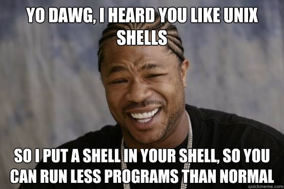
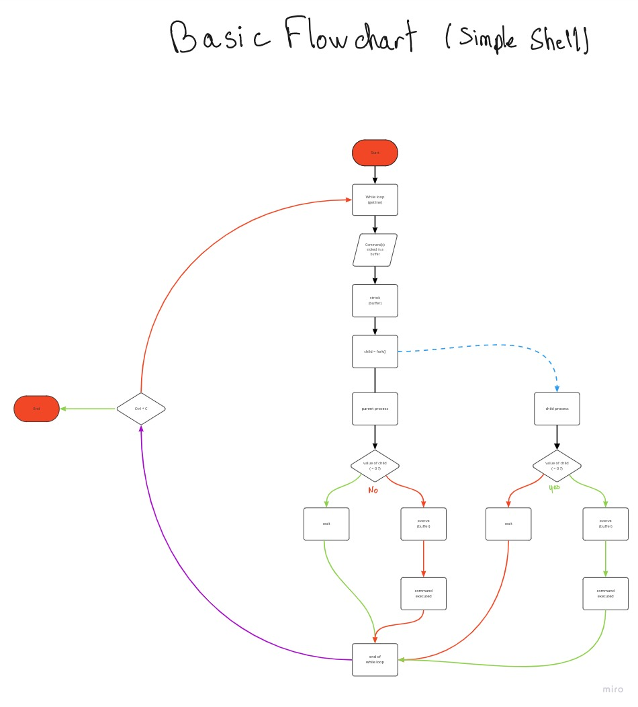
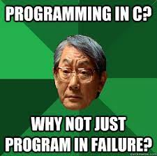

# holbertonschool-simple_shell



# Summary


# Project presentation


# Learning Objectives

- Who designed and implemented the original Unix operating system
- Who wrote the first version of the UNIX shell
- Who invented the B programming language (the direct predecessor to the C 
programming language)
- Who is Ken Thompson
- How does a shell work
- What is a pid and a ppid
- How to manipulate the environment of the current process
- What is the difference between a function and a system call
- How to create processes
- What are the three prototypes of main
- How does the shell use the PATH to find the programs
- How to execute another program with the execve system call
- How to suspend the execution of a process until one of its children
terminates
- What is EOF / “end-of-file”?


# Requirements

- Allowed editors: vi, vim, emacs
- All your files will be compiled on Ubuntu 20.04 LTS using gcc, using the options -Wall -Werror -Wextra -pedantic -std=gnu89
- All your files should end with a new line
- A README.md file, at the root of the folder of the project is mandatory
- Your code should use the Betty style. It will be checked using betty-style.pl and betty-doc.pl
- Your shell should not have any memory leaks
- No more than 5 functions per file
- All your header files should be include guarded
- Use system calls only when you need to (why?)

# More info

## Output

- Unless specified otherwise, your program must have the exact same output as sh (/bin/sh) as well as the exact same error output.
- The only difference is when you print an error, the name of the program must be equivalent to your argv[0] (See below)

Example of error with sh:
```
$ echo "qwerty" | /bin/sh
/bin/sh: 1: qwerty: not found
$ echo "qwerty" | /bin/../bin/sh
/bin/../bin/sh: 1: qwerty: not found
$
```

Same error with your program hsh:
```
$ echo "qwerty" | ./hsh
./hsh: 1: qwerty: not found
$ echo "qwerty" | ./././hsh
./././hsh: 1: qwerty: not found
$
```


## Compilation

Your shell will be compiled this way:
```
gcc -Wall -Werror -Wextra -pedantic -std=gnu89 *.c -o hsh

```


## Testing

Your shell should work like this in interactive mode:
```
$ ./hsh
($) /bin/ls
hsh main.c shell.c
($)
($) exit
$
```

But also in non-interactive mode:
```
$ echo "/bin/ls" | ./hsh
hsh main.c shell.c test_ls_2
$
$ cat test_ls_2
/bin/ls
/bin/ls
$
$ cat test_ls_2 | ./hsh
hsh main.c shell.c test_ls_2
hsh main.c shell.c test_ls_2
$
```


# Questions

## 0. README, man, AUTHORS

- Write a README
- Write a man for your shell.
- You should have an AUTHORS file at the root of your repository, listing all individuals having contributed content to the repository.


## 1. Betty would be proud

Write a beautiful code that passes the Betty checks


## 2. Simple shell 0.1

Write a UNIX command line interpreter.
- Usage: simple_shell

Your Shell should:
- Display a prompt and wait for the user to type a command. A command line always ends with a new line.
- The prompt is displayed again each time a command has been executed.
- The command lines are simple, no semicolons, no pipes, no redirections or any other advanced features.
- The command lines are made only of one word. No arguments will be passed to programs.
- If an executable cannot be found, print an error message and display the prompt again.
- Handle errors.
- You have to handle the “end of file” condition (Ctrl+D)

You don’t have to:

- use the PATH
- implement built-ins
- handle special characters : ", ', `, \, *, &, #
- be able to move the cursor
- handle commands with arguments

execve will be the core part of your Shell, don’t forget to pass the environ to it…
```
julien@ubuntu:~/shell$ ./shell 
#cisfun$ ls
./shell: No such file or directory
#cisfun$ /bin/ls
barbie_j       env-main.c  exec.c  fork.c  pid.c  ppid.c    prompt   prompt.c  shell.c  stat.c         wait
env-environ.c  exec    fork    mypid   ppid   printenv  promptc  shell     stat test_scripting.sh  wait.c
#cisfun$ ^[[D^[[D^[[D
./shell: No such file or directory
#cisfun$ ^[[C^[[C^[[C^[[C
./shell: No such file or directory
#cisfun$ exit
./shell: No such file or directory
#cisfun$ ^C
julien@ubuntu:~/shell$ echo "/bin/ls" | ./shell
barbie_j       env-main.c  exec.c  fork.c  pid.c  ppid.c    prompt   prompt.c  shell.c  stat.c         wait
env-environ.c  exec    fork    mypid   ppid   printenv  promptc  shell     stat test_scripting.sh  wait.c
#cisfun$ julien@ubuntu:~/shell$
```


## 3. Simple shell 0.2

Simple shell 0.1 +
- Handle command lines with arguments


## 4. Simple shell 0.3

Simple shell 0.2 +
- Handle the PATH
- fork must not be called if the command doesn’t exist
```
julien@ubuntu:~/shell$ ./shell_0.3
:) /bin/ls
barbie_j       env-main.c  exec.c  fork.c  pid.c  ppid.c    prompt   prompt.c  shell_0.3  stat    test_scripting.sh  wait.c
env-environ.c  exec    fork    mypid   ppid   printenv  promptc  shell     shell.c    stat.c  wait
:) ls
barbie_j       env-main.c  exec.c  fork.c  pid.c  ppid.c    prompt   prompt.c  shell_0.3  stat    test_scripting.sh  wait.c
env-environ.c  exec    fork    mypid   ppid   printenv  promptc  shell     shell.c    stat.c  wait
:) ls -l /tmp 
total 20
-rw------- 1 julien julien    0 Dec  5 12:09 config-err-aAMZrR
drwx------ 3 root   root   4096 Dec  5 12:09 systemd-private-062a0eca7f2a44349733e78cb4abdff4-colord.service-V7DUzr
drwx------ 3 root   root   4096 Dec  5 12:09 systemd-private-062a0eca7f2a44349733e78cb4abdff4-rtkit-daemon.service-ANGvoV
drwx------ 3 root   root   4096 Dec  5 12:07 systemd-private-062a0eca7f2a44349733e78cb4abdff4-systemd-timesyncd.service-CdXUtH
-rw-rw-r-- 1 julien julien    0 Dec  5 12:09 unity_support_test.0
:) ^C
julien@ubuntu:~/shell$ 
```


## 5. Simple shell 0.4

Simple shell 0.3 +
- Implement the exit built-in, that exits the shell
- Usage: exit
- You don’t have to handle any argument to the built-in exit


## 6. Simple shell 1.0

Simple shell 0.4 +
- Implement the env built-in, that prints the current environment
```
julien@ubuntu:~/shell$ ./simple_shell
$ env
USER=julien
LANGUAGE=en_US
SESSION=ubuntu
COMPIZ_CONFIG_PROFILE=ubuntu
SHLVL=1
HOME=/home/julien
C_IS=Fun_:)
DESKTOP_SESSION=ubuntu
LOGNAME=julien
TERM=xterm-256color
PATH=/home/julien/bin:/home/julien/.local/bin:/usr/local/sbin:/usr/local/bin:/usr/sbin:/usr/bin:/sbin:/bin:/usr/games:/usr/local/games:/snap/bin
DISPLAY=:0
$ exit
julien@ubuntu:~/shell$ 
```


## 7. What happens when you type `ls -l *.c` in the shell

Write a blog post describing step by step what happens when you type ls -l *.c and hit Enter in a shell. Try to explain every step you know of, going in as much details as you can, give examples and draw diagrams when needed. You should merge your previous knowledge of the shell with the specifics of how it works under the hoods (including syscalls).
- Have at least one picture, at the top of the blog post
- Publish your blog post on Medium or LinkedIn
- Share your blog post at least on LinkedIn
- Only one blog post by team
- The blog post must be done and published before the first deadline (it will be part of the manual review)
- Please, remember that these blogs must be written in English to further your technical ability in a variety of settings
When done, please add all urls below (blog post, LinkedIn post, etc.)


## 8. Test suite


## 9. Simple shell 0.1.1

Simple shell 0.1 +
- Write your own getline function
- Use a buffer to read many chars at once and call the least possible the read system call
- You will need to use static variables
- You are not allowed to use getline
You don’t have to:
- be able to move the cursor


## 10. Simple shell 0.2.1

Simple shell 0.2 +
- You are not allowed to use strtok


## 11. Simple shell 0.4.1

Simple shell 0.4 +
- handle arguments for the built-in exit
- Usage: exit status, where status is an integer used to exit the shell
```
julien@ubuntu:~/shell$ ./shell_0.4.1
$ exit 98
julien@ubuntu:~/shell$ echo $?
98
julien@ubuntu:~/shell$ 
```


## 12. Simple shell 0.4.2

Simple shell 0.4 +
- Handle Ctrl+C: your shell should not quit when the user inputs ^C
man 2 signal.
```
julien@ubuntu:~/shell$ ./shell_0.4.2
$ ^C
$ ^C
$ ^C
$ ls /var
backups  cache  crash  lib  local  lock  log  mail  metrics  opt  run  snap  spool  tmp
$ ^C
$ ^C
$ ^C
$ exit
julien@ubuntu:~/shell$ 
```


## 13. setenv, unsetenv

Simple shell 1.0 +
Implement the setenv and unsetenv builtin commands
- setenv
-- Initialize a new environment variable, or modify an existing one
-- Command syntax: setenv VARIABLE VALUE
-- Should print something on stderr on failure
- unsetenv
-- Remove an environment variable
-- Command syntax: unsetenv VARIABLE
-- Should print something on stderr on failure


## 14. cd

Simple shell 1.0 +
Implement the builtin command cd:
- Changes the current directory of the process.
- Command syntax: cd [DIRECTORY]
- If no argument is given to cd the command must be interpreted like cd $HOME
- You have to handle the command cd -
- You have to update the environment variable PWD when you change directory
man chdir, man getcwd


## 15. ;

Simple shell 1.0 +
- Handle the commands separator ;
```
alex@~$ ls /var ; ls /var
backups  cache  crash  lib  local  lock  log  mail  metrics  opt  run  spool  tmp
backups  cache  crash  lib  local  lock  log  mail  metrics  opt  run  spool  tmp
alex@~$ ls /hbtn ; ls /var
ls: cannot access /hbtn: No such file or directory
backups  cache  crash  lib  local  lock  log  mail  metrics  opt  run  spool  tmp
alex@~$ ls /var ; ls /hbtn
backups  cache  crash  lib  local  lock  log  mail  metrics  opt  run  spool  tmp
ls: cannot access /hbtn: No such file or directory
alex@~$ ls /var ; ls /hbtn ; ls /var ; ls /var
backups  cache  crash  lib  local  lock  log  mail  metrics  opt  run  spool  tmp
ls: cannot access /hbtn: No such file or directory
backups  cache  crash  lib  local  lock  log  mail  metrics  opt  run  spool  tmp
backups  cache  crash  lib  local  lock  log  mail  metrics  opt  run  spool  tmp
alex@~$
```


## 16. && and ||

Simple shell 1.0 +
- Handle the && and || shell logical operators
```
alex@~$ ls /var && ls /var
backups  cache  crash  lib  local  lock  log  mail  metrics  opt  run  spool  tmp
backups  cache  crash  lib  local  lock  log  mail  metrics  opt  run  spool  tmp
alex@~$ ls /hbtn && ls /var
ls: cannot access /hbtn: No such file or directory
alex@~$ ls /var && ls /var && ls /var && ls /hbtn
backups  cache  crash  lib  local  lock  log  mail  metrics  opt  run  spool  tmp
backups  cache  crash  lib  local  lock  log  mail  metrics  opt  run  spool  tmp
backups  cache  crash  lib  local  lock  log  mail  metrics  opt  run  spool  tmp
ls: cannot access /hbtn: No such file or directory
alex@~$ ls /var && ls /var && ls /var && ls /hbtn && ls /hbtn
backups  cache  crash  lib  local  lock  log  mail  metrics  opt  run  spool  tmp
backups  cache  crash  lib  local  lock  log  mail  metrics  opt  run  spool  tmp
backups  cache  crash  lib  local  lock  log  mail  metrics  opt  run  spool  tmp
ls: cannot access /hbtn: No such file or directory
alex@~$
alex@~$ ls /var || ls /var
backups  cache  crash  lib  local  lock  log  mail  metrics  opt  run  spool  tmp
alex@~$ ls /hbtn || ls /var
ls: cannot access /hbtn: No such file or directory
backups  cache  crash  lib  local  lock  log  mail  metrics  opt  run  spool  tmp
alex@~$ ls /hbtn || ls /hbtn || ls /hbtn || ls /var
ls: cannot access /hbtn: No such file or directory
ls: cannot access /hbtn: No such file or directory
ls: cannot access /hbtn: No such file or directory
backups  cache  crash  lib  local  lock  log  mail  metrics  opt  run  spool  tmp
alex@~$ ls /hbtn || ls /hbtn || ls /hbtn || ls /var || ls /var
ls: cannot access /hbtn: No such file or directory
ls: cannot access /hbtn: No such file or directory
ls: cannot access /hbtn: No such file or directory
backups  cache  crash  lib  local  lock  log  mail  metrics  opt  run  spool  tmp
alex@~$
```


## 17. alias

Simple shell 1.0 +
- Implement the alias builtin command
- Usage: alias [name[='value'] ...]
-- alias: Prints a list of all aliases, one per line, in the form name='value'
-- alias name [name2 ...]: Prints the aliases name, name2, etc 1 per line, in the form name='value'
-- alias name='value' [...]: Defines an alias for each name whose value is given. If name is already an alias, replaces its value with value


## 18. Variables

Simple shell 1.0 +
- Handle variables replacement
- Handle the $? variable
- Handle the $$ variable
```
julien@ubuntu:~/shell$ ./hsh
$ ls /var
backups  cache  crash  lib  local  lock  log  mail  metrics  opt  run  snap  spool  tmp
$ echo $?
0
$ echo $$
5104
$ echo $PATH
/home/julien/bin:/home/julien/.local/bin:/usr/local/sbin:/usr/local/bin:/usr/sbin:/usr/bin:/sbin:/bin:/usr/games:/usr/local/games:/snap/bin
$ exit 
julien@ubuntu:~/shell$ 
```


## 19. Comments

Simple shell 1.0 +
- Handle comments (#)
```
julien@ubuntu:~/shell$ sh
$ echo $$ # ls -la
5114
$ exit
julien@ubuntu:~/shell$
```


## 20. help

Simple shell 1.0 +
- Implement the help built-in
- Usage: help [BUILTIN]


## 21. history

Simple shell 1.0 +
- Implement the history built-in, without any argument
- The history built-in displays the history list, one command by line, preceded with line numbers (starting at 0)
- On exit, write the entire history, without line numbers, to a file named .simple_shell_history in the directory $HOME
- When the shell starts, read the file .simple_shell_history in the directory $HOME if it exists, and set the first line number to the total number of lines in the file modulo 4096


## 22. File as input

Simple shell 1.0 +
- Usage: simple_shell [filename]
- Your shell can take a file as a command line argument
- The file contains all the commands that your shell should run before exiting
- The file should contain one command per line
- In this mode, the shell should not print a prompt and should not read from stdin


# Reminder


# flowcharts



# Sources

* Making your own Linux Shell in C
https://www.geeksforgeeks.org/making-linux-shell-c/

* GNU/Linux
https://www.youtube.com/watch?v=py1E14pXfAM&ab_channel=FormationVid%C3%A9o

* Tutorial - Write a Shell in C
https://brennan.io/2015/01/16/write-a-shell-in-c/

* Unix User Course
https://coursunix.wordpress.com/2013/05/01/architecture-noyau-kernel-et-shell/

* Write your own shell
https://ftp.traduc.org/doc-vf/gazette-linux/html/2005/111/lg111-G.html

* What happens where you type ls -l in a Linux Shell
https://levelup.gitconnected.com/what-happens-where-you-type-ls-l-in-a-linux-shell-98ad95430cbf

* strtok function
https://koor.fr/C/cstring/strtok.wp

* Unix shell
https://en.wikipedia.org/wiki/Unix_shell

* Thompson shell
https://en.wikipedia.org/wiki/Thompson_shell

* Ken Thompson
https://en.wikipedia.org/wiki/Ken_Thompson

# man

* access
https://man7.org/linux/man-pages/man2/access.2.html

* chdir
https://man7.org/linux/man-pages/man2/chdir.2.html

* close
https://man7.org/linux/man-pages/man2/close.2.html

* closedir
https://man7.org/linux/man-pages/man3/closedir.3.html

* execve
https://man7.org/linux/man-pages/man2/execve.2.html

* exit
https://man7.org/linux/man-pages/man3/exit.3.html

* _exit
https://man7.org/linux/man-pages/man2/_exit.2.html

* fflush
https://man7.org/linux/man-pages/man3/fflush.3.html

* fork
https://man7.org/linux/man-pages/man2/fork.2.html

* free
https://man7.org/linux/man-pages/man3/free.3p.html

* getcwd
https://man7.org/linux/man-pages/man3/getcwd.3.html

* getline
https://man7.org/linux/man-pages/man3/getline.3.html

* getpid
https://man7.org/linux/man-pages/man2/getpid.2.html

* isatty
https://www.man7.org/linux/man-pages/man3/isatty.3.html

* kill
https://man7.org/linux/man-pages/man2/kill.2.html

* malloc
https://man7.org/linux/man-pages/man3/malloc.3.html

* open
https://man7.org/linux/man-pages/man2/open.2.html

* opendir
https://man7.org/linux/man-pages/man3/opendir.3.html

* perror
https://man7.org/linux/man-pages/man3/sys_nerr.3.html

* read
https://man7.org/linux/man-pages/man2/read.2.html

* readdir
https://man7.org/linux/man-pages/man3/readdir.3.html

* signal
https://man7.org/linux/man-pages/man2/signal.2.html

* stat(__xstat)
https://man7.org/linux/man-pages/man2/lstat.2.html

* lstat(__lxstat)
https://man7.org/linux/man-pages/man2/lstat.2.html

* fstat(__fxstat)
https://linux.die.net/man/2/fstat

* strtok
https://man7.org/linux/man-pages/man3/strtok.3.html

* wait
https://man7.org/linux/man-pages/man2/wait.2.html

* waitpid
https://linux.die.net/man/2/waitpid

* wait3
https://linux.die.net/man/2/wait3

* wait4
https://man7.org/linux/man-pages/man2/wait3.2.html

* write
https://man7.org/linux/man-pages/man2/write.2.html

# Tools

C Language
Valgrind !!!


